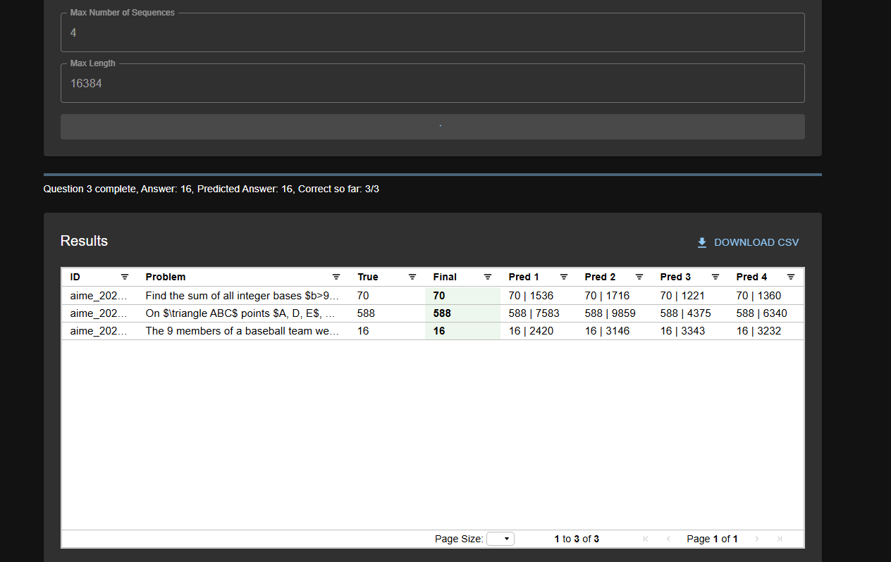

# Math QA Batch Evaluation

A full-stack application that provides batch inference capabilities for math problem solving.


Most of the frontend is developed using [Cursor](https://www.cursor.com/)

## Features

- Batch Inference
  - Upload CSV files with math problems
  - Configurable parameters (model name, system prompt, max sequences, max length)
  - Progress tracking and results visualization
  - Export results to CSV

## Prerequisites

- Python 3.8+
- Node.js 14+
- CUDA-capable GPU
- SGLang library
- Your model

## Setup

1. Clone the repository:
```bash
git clone https://github.com/bogoconic1/aimo-inference-service.git
cd aimo-inference-service
```

2. Initial Setup:
```bash
bash setup.sh
```

## Running the Application

1. Start the backend server:
```bash
cd backend
python main.py
```

2. Start the frontend development server:
```bash
cd frontend
npm start
```

The application will be available at:
- Frontend: http://localhost:3000
- Backend API: http://localhost:8000

## Usage

### Batch Inference
1. Upload a CSV file with 'id', 'problem', and 'answer' columns
2. Configure max_num_seqs (default: 3) and max_length (default: 1000) parameters
3. Click Process Batch
4. View results in the table
5. Download results as CSV

## CSV Format for Batch Inference

The input CSV file should have the following columns:
- id: A unique identifier for each problem
- problem: The math problem text
- answer: The correct answer

Example:
```csv
id,problem,answer
1,"What is 2 + 2?",4
2,"Solve for x: 3x + 5 = 20",5
```

Click "Submit" and leave it all to the server after that! Intermediate progress will be shown as the evaluation goes!


Intermediate Progress


## License

Apache 2.0